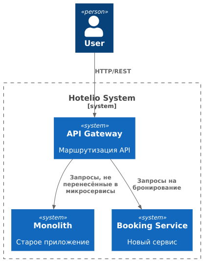
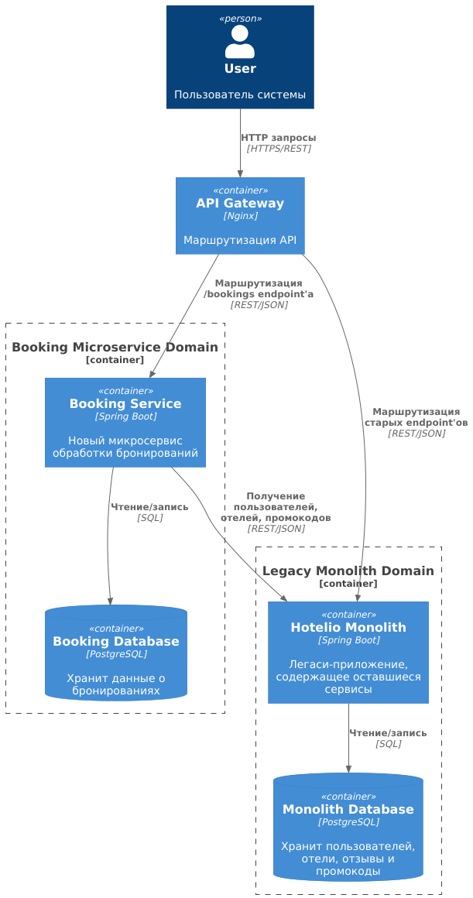

### **Название задачи: Переход от монолитной архитектуры Hotelio к микросервисной архитектуре**

### **Автор: Vadim Volkovskiy**

### **Дата: 08.11.25**

### **Функциональные требования**

| № | Действующие лица / системы | Use Case                      | Описание                                                                                                                                |
|:-:|----------------------------|-------------------------------|-----------------------------------------------------------------------------------------------------------------------------------------|
| 1 | Пользователь → Система     | Создание бронирования         | Пользователь запрашивает создание бронирования. Система должна проверить пользователя, отель, промокод, рейтинг и выполнить сохранение. |
| 2 | Система → UserService      | Проверка статуса пользователя | Перед бронированием система убеждается, что пользователь активен и не заблокирован.                                                     |
| 3 | Система → HotelService     | Получение информации об отеле | Проверка существования отеля и доступности номеров.                                                                                     |
| 4 | Система → PromoCodeService | Проверка промокода            | Проверка действительности промокода, соответствия пользователю и заказу.                                                                |
| 5 | Система → ReviewService    | Проверка рейтинга отеля       | Если рейтинг ниже допустимого значения — бронирование блокируется.                                                                      |
| 6 | DevOps / CI/CD             | Постепенный вынос сервисов    | Возможность постепенно выделять сервисы из монолита, не останавливая работу системы.                                                    |

### **Нефункциональные требования**

| № | Требование                                                                                           |
|:-:|------------------------------------------------------------------------------------------------------|
| 1 | Масштабируемость: возможность масштабировать только нагруженные компоненты (например, бронирования). |
| 2 | Отказоустойчивость: сбой одного сервиса не должен останавливать всю систему.                         |
| 3 | Независимая разработка: команды должны иметь возможность работать над сервисами параллельно.         |
| 4 | Наблюдаемость: логирование, метрики и трассировка запросов между сервисами.                          |
| 5 | Минимизация бизнес-рисков: перенос сервисов должен происходить поэтапно, без остановки системы.      |
| 6 | API-взаимодействие: сервисы должны взаимодействовать по REST / gRPC (в зависимости от сценария).     |

### **Решение**

Приведите диаграммы контекста и контейнеров в модели C4. Опишите там основные компоненты и интеграции всех элементов
решения.

Также опишите, какой логикой вы руководствовались в ходе принятия решений и выбора технологий. Не забывайте, что
необходимо учесть все функциональные и нефункциональные требования.

#### 🏛️ Выбранный архитектурный подход

Паттерн **Strangler Fig**:

- Монолит остаётся основой текущего функционала.
- Выделяемые сервисы перехватывают часть запросов.
- Монолит постепенно «обрастает» микросервисами, пока полностью не исчезнет.

#### 📌 Ключевой первый шаг миграции

Вынос **BookingService** в отдельный сервис, так как это:

- наиболее нагруженный компонент,
- имеет чёткие входные/выходные данные,
- требует масштабируемости.

Промежуточная диаграмма контекста:    

Промежуточная диаграмма контейнеров:

Целевое состояние системы через год:

### **Альтернативы**

| Альтернатива                          | Почему не выбрана                                        |
|---------------------------------------|----------------------------------------------------------|
| Переписать систему «с нуля»           | Высокий риск, остановка/замедление работы бизнеса        |
| Вынести только слой контроллеров      | Увеличит связанность, логика останется внутри монолита   |
| Использовать общую БД между сервисами | Приведёт к сильной связанности и сложности миграции схем |

---

**Недостатки, ограничения, риски**

- Временная **сложность поддержки двух архитектур одновременно**.
- Требуется настройка **распределённого логирования и трассировки**.
- Возможны **временные накладные расходы** на сетевую коммуникацию между сервисами.
- Потребуется **выделение DevOps-ресурсов** для инфраструктуры (CI/CD, мониторинг, Kubernetes).

